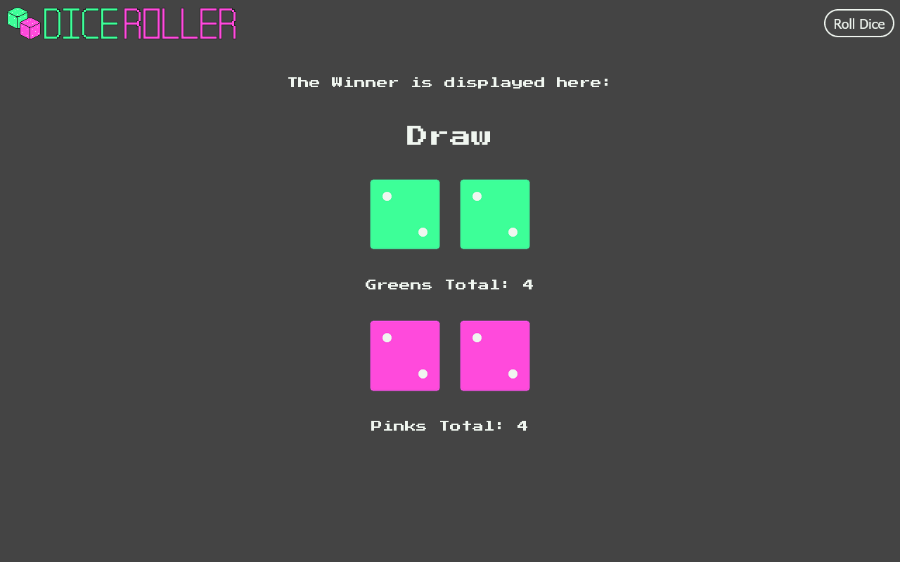

# Dice Roller 

My Seconed Project using HTML, CSS & JS.

## Description

A website which allows the user to roll 2 sets of dice and calculate the winner.  
(Green vs Pink)

## Screenshot

## Links

Live Site URL: [Live Github Page](https://john-csm-tate.github.io/dice-roller/)

## Author Links

[ LinkedIn](https://www.linkedin.com/in/john-csm-tate/)
